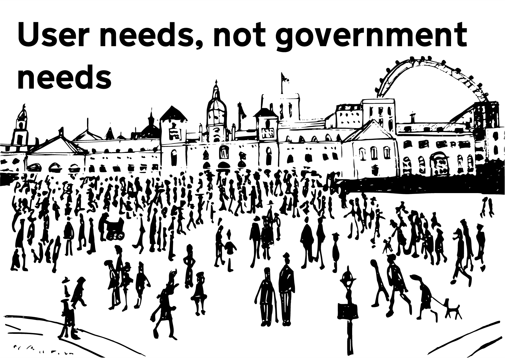
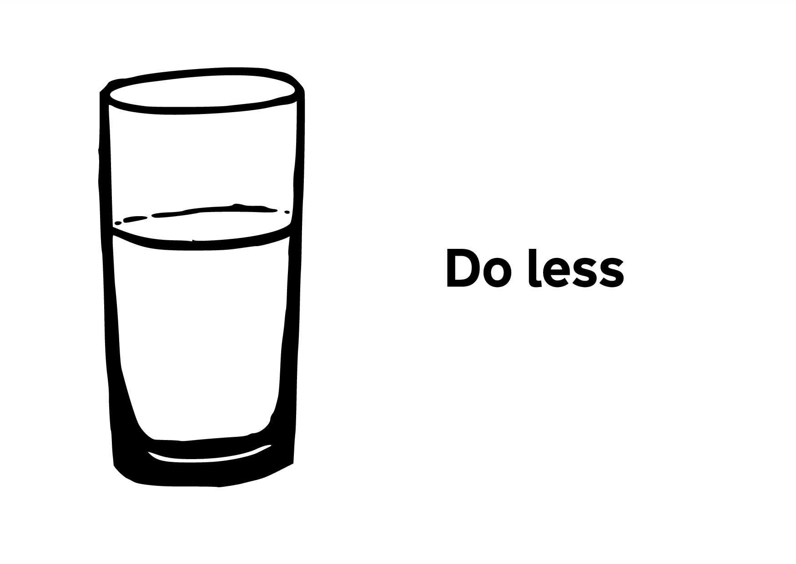
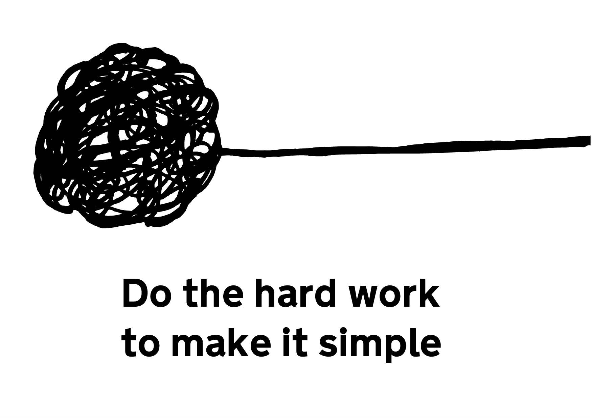
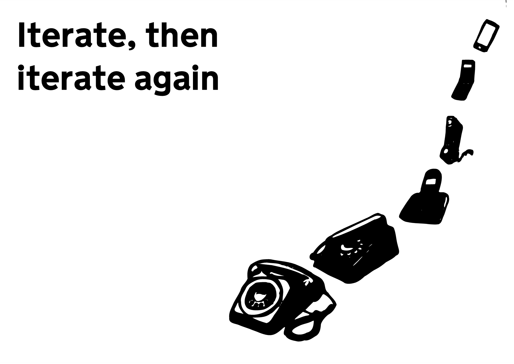
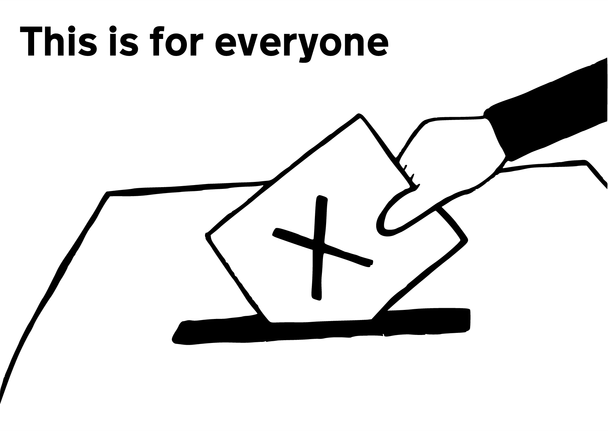
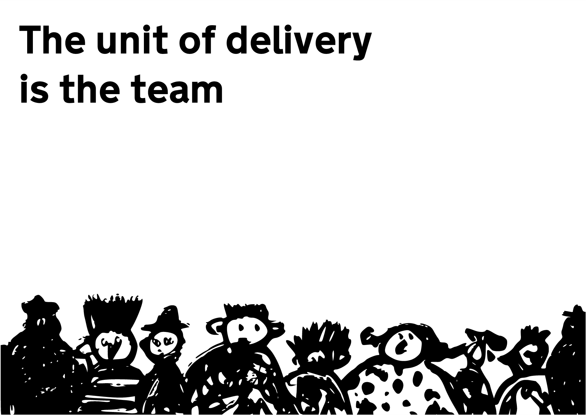
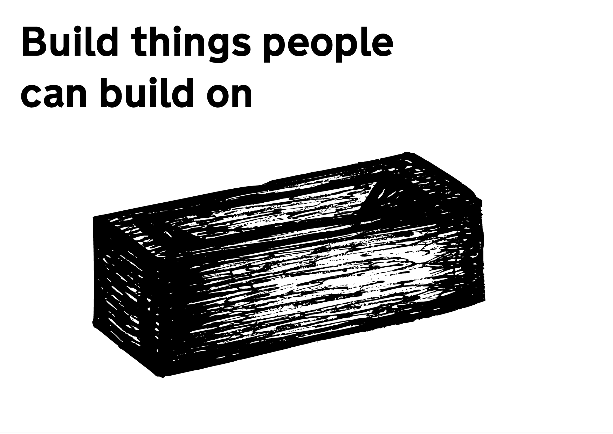
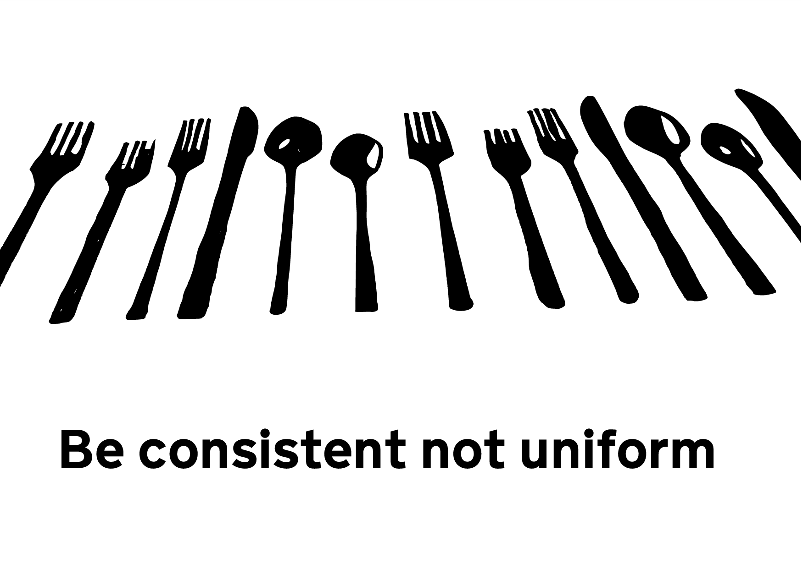
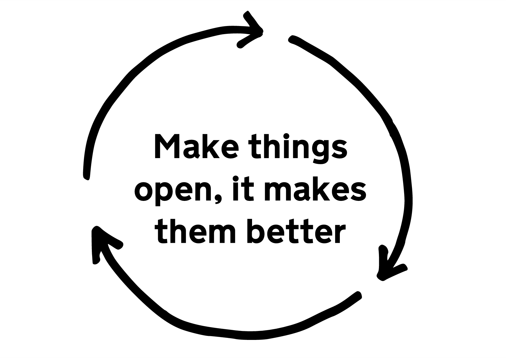

Posters and other doodled artwork for the [Government Digital Service Design Principles](https://www.gov.uk/designprinciples).

The content is [Crown Copyright](https://www.nationalarchives.gov.uk/information-management/re-using-public-sector-information/uk-government-licensing-framework/crown-copyright/) and published under the [Open Government Licence v3.0](https://www.nationalarchives.gov.uk/doc/open-government-licence/version/3/).

Building the posters is a little bit of a bother, so they're here:
- [posters](posters) — each principle on an A4 page
- [postcards](postcards) — each principle as a postcard
- [slides](slides) — each principle as a 4:3 slide
- [booklet](booklet) — a folding booklet of the principles

## Postcards

## Source
- [drawings](drawings) — the original drawings as SVG
- [principles](principles) — markdown and metadata for each principle.
- [templates](templates) — HTML templates for the posters
- [static](static) — CSS and other things used to build the posters

## Rebuilding

    $ make init
    $ make clean
    $ make

## Dependencies

Depends upon the [nodejs][nodejs] module, [wkhtmltopdf][wkhtmltopdf], and [ghostscript][ghostscript].

You may need an [older version](http://stackoverflow.com/questions/12517640) of [wkhtmltopdf][wkhtmltopdf] on Mac OS X.

[nodejs]: http://nodejs.org/ "node.js"
[wkhtmltopdf]: http://wkhtmltopdf.org/ "open source command line which uses Webkit to generate a PDF from an HTML page"
[ghostscript]: http://www.ghostscript.com/ "open source interpreter for the PostScript language and for PDF"
